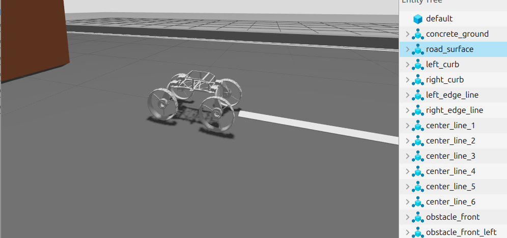
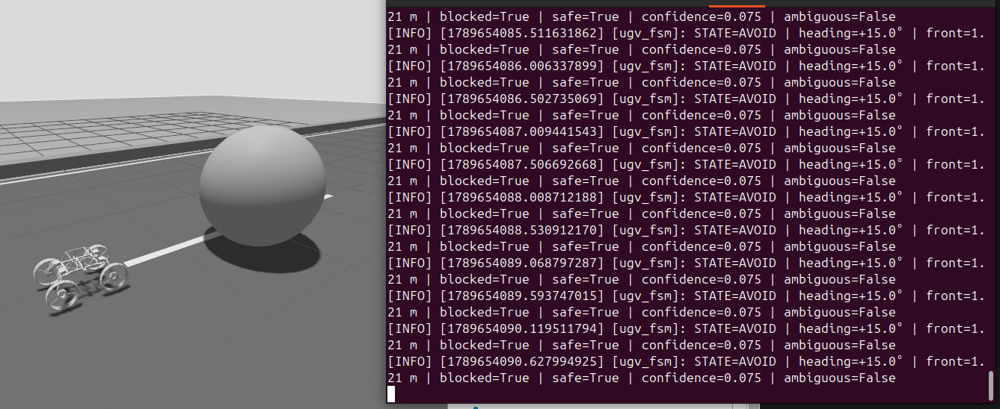
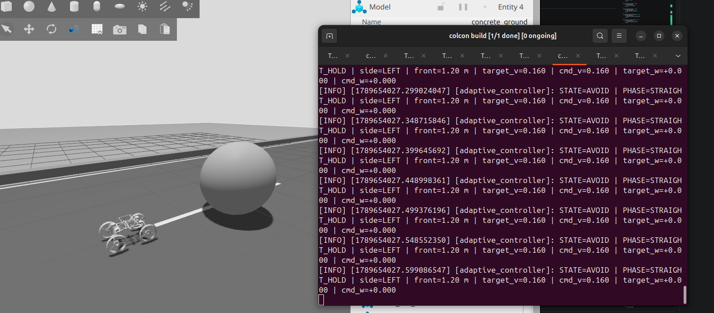
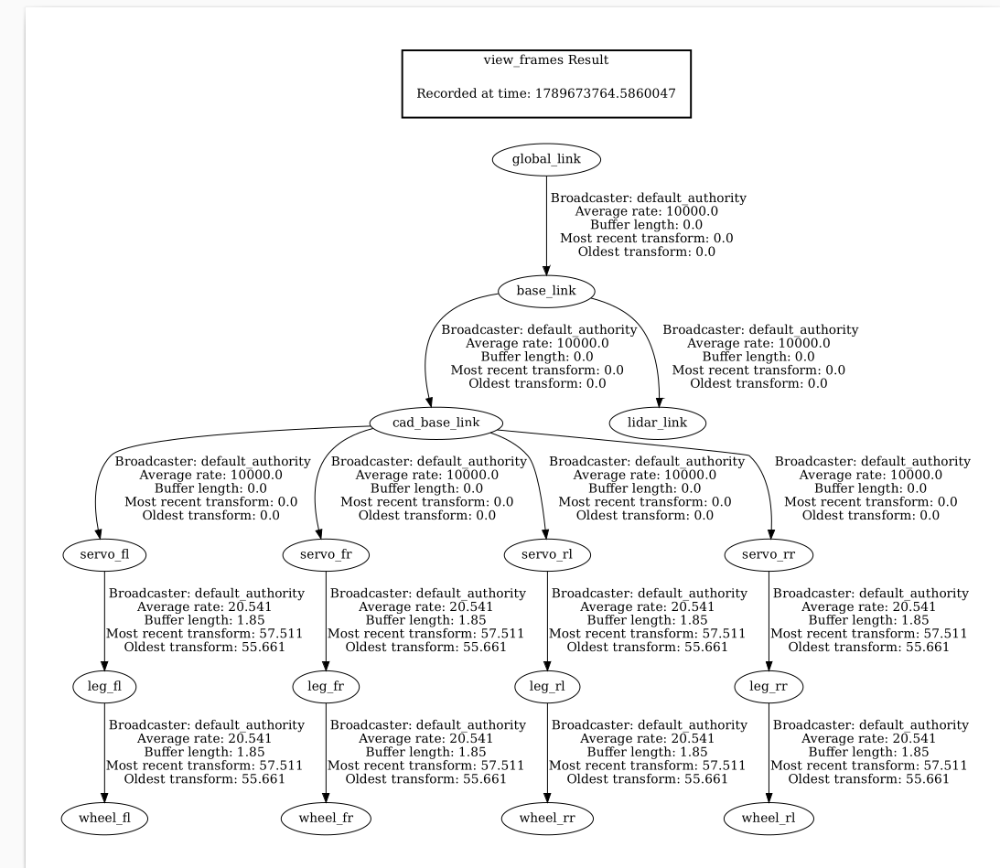

# Morphobot Autonomy

This project presents a ROS 2-based autonomy stack developed for the **Morphobot** hybrid UGV-UAV platform. The current implementation focuses on autonomous ground-mode operation using LiDAR-based obstacle perception, directional clearance estimation, decision-making, finite-state control, obstacle avoidance, and adaptive motion control.

The robot is simulated in Gazebo and uses ROS 2 Control, TF2, LiDAR perception, and differential-drive control. The autonomy pipeline processes LiDAR data to detect obstacles, evaluates the available directions, selects an avoidance direction, and commands the robot through an adaptive motion controller.

The current development stage has been completed up to autonomous local obstacle avoidance. Goal-directed navigation, path planning, and full autonomous navigation are planned as future development stages.

---

## Robot Structure

```text
global_link
└── base_link
    ├── cad_base_link
    │   ├── servo_fl
    │   │   └── leg_fl
    │   │       └── wheel_fl
    │   │
    │   ├── servo_fr
    │   │   └── leg_fr
    │   │       └── wheel_fr
    │   │
    │   ├── servo_rl
    │   │   └── leg_rl
    │   │       └── wheel_rr
    │   │
    │   └── servo_rr
    │       └── leg_rr
    │           └── wheel_rl
    │
    └── lidar_link
```

---

## Features

- URDF/Xacro-based robot description
- Four-wheel ground-mode configuration
- ROS 2 Control integration
- Differential-drive controller
- LiDAR sensor integration
- LiDAR-based environment perception
- Front and side clearance estimation
- Obstacle detection
- Path-blocking evaluation
- Direction scoring
- Decision stabilization
- UGV Finite State Machine (FSM)
- Obstacle avoidance
- Adaptive motion controller
- Linear and angular velocity control
- `/cmd_vel` integration
- TF2 frame transformations
- Gazebo simulation
- Real-time autonomy diagnostics

---

## Gazebo Simulation

<p align="center">
  
</p>

The Morphobot ground platform is simulated in Gazebo for development and testing of the autonomy stack. The simulated environment contains obstacles that are used to evaluate LiDAR perception and autonomous obstacle avoidance.

The robot receives LiDAR measurements from the simulated environment and processes the sensor data through the autonomy pipeline.

---

## Autonomy Pipeline

The autonomy system follows a layered perception-to-control architecture:

```text
LiDAR
  │
  ▼
LiDAR Processing
  │
  ▼
Environment State
  │
  ▼
Directional Clearance
  │
  ▼
Direction Scoring
  │
  ▼
Decision Stabilization
  │
  ▼
UGV Finite State Machine
  │
  ▼
Adaptive Motion Controller
  │
  ▼
/cmd_vel
  │
  ▼
Wheel Controller
  │
  ▼
Gazebo / Robot
```

Each layer performs a specific function, allowing perception, decision-making, behavioral control, and motion-control components to operate as separate modules.

---

## UGV Finite State Machine

<p align="center">
  
</p>

The UGV Finite State Machine manages the robot's behavior during normal motion and obstacle avoidance. The current FSM includes states for normal driving, obstacle avoidance, and path verification.

A typical behavior is:

```text
DRIVE
  │
  │ Obstacle detected
  ▼
AVOID
  │
  │ Obstacle cleared
  ▼
VERIFY
  │
  │ Path confirmed
  ▼
DRIVE
```

The FSM receives information from the perception and decision layers, including front clearance, obstacle status, selected avoidance direction, heading, and safety conditions.

---

## Adaptive Motion Controller

<p align="center">
  
</p>

The adaptive motion controller converts the high-level avoidance decision into linear and angular velocity commands. The controller adjusts the robot's motion according to the current autonomy state and selected avoidance direction. The resulting velocity command is passed to the differential-drive controller through ROS 2.

```text
Navigation Decision
        │
        ▼
Adaptive Controller
        │
   ┌────┴────┐
   ▼         ▼
Linear     Angular
Velocity   Velocity
   │         │
   └────┬────┘
        ▼
     /cmd_vel
        │
        ▼
Differential Drive
        │
        ▼
      Wheels
```

---

## Obstacle Avoidance

The obstacle avoidance system uses LiDAR measurements to determine whether the forward path is blocked.

When an obstacle is detected, the system:

1. Processes the LiDAR measurements.
2. Calculates directional clearance.
3. Determines whether the path is blocked.
4. Evaluates the available avoidance directions.
5. Selects an avoidance side.
6. Stabilizes the decision to prevent rapid switching.
7. Passes the decision to the UGV FSM.
8. Generates motion commands through the adaptive controller.
9. Moves the robot around the obstacle.
10. Verifies the path before returning to normal driving.

Example runtime information:

```text
STATE=AVOID
heading=+15.0°
front=1.21 m
blocked=True
safe=True
confidence=0.075
ambiguous=False
```

The adaptive controller provides additional information about the current avoidance phase:

```text
STATE=AVOID
PHASE=STRAIGHT_HOLD
side=LEFT
front=1.20 m
target_v=0.160
cmd_v=0.160
target_w=+0.000
cmd_w=+0.000
```

---

## Obstacle Avoidance Demonstration

<p align="center">
  <video src="images/demo.mp4" width="700" controls></video>
</p>

The demonstration shows the Morphobot detecting an obstacle in the Gazebo environment and executing an autonomous avoidance maneuver. The robot uses LiDAR measurements to detect the obstacle, selects an avoidance direction, and generates the required motion commands through the FSM and adaptive motion controller.

---

## TF Frame Structure

<p align="center">
  
</p>

The TF2 tree establishes the spatial relationships between the Morphobot base, LiDAR, servo assemblies, legs, and wheels.

The current TF structure generated from the running simulation is:

```text
global_link
└── base_link
    ├── cad_base_link
    │   ├── servo_fl
    │   │   └── leg_fl
    │   │       └── wheel_fl
    │   │
    │   ├── servo_fr
    │   │   └── leg_fr
    │   │       └── wheel_fr
    │   │
    │   ├── servo_rl
    │   │   └── leg_rl
    │   │       └── wheel_rr
    │   │
    │   └── servo_rr
    │       └── leg_rr
    │           └── wheel_rl
    │
    └── lidar_link
```

The TF tree can be generated using:

```bash
cd "/media/zbook/Data/morphobot 2"

source /opt/ros/kilted/setup.bash
source "/media/zbook/Data/morphobot 2/install/setup.bash"

ros2 run tf2_tools view_frames
```

The command listens for TF data and generates a timestamped PDF containing the TF graph.

The live TF tree can also be inspected using:

```bash
ros2 run rqt_tf_tree rqt_tf_tree
```

---

## ROS 2 Topics

| Topic | Description |
|---|---|
| `/scan` | LiDAR measurements |
| `/cmd_vel` | Robot velocity commands |
| `/diff_drive_controller/cmd_vel` | Differential-drive controller commands |
| `/joint_states` | Robot joint states |
| `/tf` | Dynamic TF transformations |
| `/tf_static` | Static TF transformations |
| `/imu` | IMU measurements |
| `/camera` | Camera data |
| `/camera_info` | Camera information |
| `/clock` | Gazebo simulation clock |

---

## Workspace

The ROS 2 workspace is located at:

```text
/media/zbook/Data/morphobot 2
```

The main autonomy package is:

```text
morphobot_autonomy
```

---

## Build

```bash
cd "/media/zbook/Data/morphobot 2"

source /opt/ros/kilted/setup.bash

colcon build --symlink-install --packages-select morphobot_autonomy
```

After building, source the workspace:

```bash
source "/media/zbook/Data/morphobot 2/install/setup.bash"
```

---

## System Verification

Check active ROS 2 nodes:

```bash
ros2 node list
```

Check available topics:

```bash
ros2 topic list
```

Check LiDAR data:

```bash
ros2 topic echo /scan
```

Check velocity commands:

```bash
ros2 topic echo /cmd_vel
```

Check TF:

```bash
ros2 topic echo /tf
```

Check controllers:

```bash
ros2 control list_controllers
```

Check hardware interfaces:

```bash
ros2 control list_hardware_interfaces
```

---

## Tools Used

- ROS 2 Kilted Kaiju
- Gazebo Sim
- URDF / Xacro
- ros2_control
- diff_drive_controller
- TF2
- LiDAR
- Python
- C++
- RViz2

---

## Project Status

- [x] Robot modeling
- [x] Gazebo simulation
- [x] Differential-drive control
- [x] LiDAR integration
- [x] TF2 integration
- [x] LiDAR environment perception
- [x] Directional clearance estimation
- [x] Direction scoring
- [x] Decision stabilization
- [x] UGV FSM
- [x] Adaptive motion controller
- [x] Obstacle detection
- [x] Local obstacle avoidance
- [ ] Obstacle-clearance verification *(in development)*
- [ ] Autonomous navigation *(future work)*
- [ ] Path planning *(future work)*
- [ ] Hardware deployment *(future work)*

---

## Future Work

- Improve obstacle-clearance verification
- Improve recovery behavior after obstacle avoidance
- Implement map-based localization
- Implement waypoint navigation
- Integrate global and local path planning
- Integrate Nav2
- Add global and local costmaps
- Implement autonomous goal navigation
- Handle dynamic obstacles
- Perform navigation performance evaluation
- Deploy the autonomy stack on the physical Morphobot
- Integrate ground autonomy with the UGV-to-UAV transformation system
- Develop unified UGV-UAV autonomy

---

## Project

**Morphobot — Hybrid UGV-UAV Platform**

The current autonomy system establishes the ground-mode foundation for Morphobot by integrating LiDAR perception, autonomous decision-making, finite-state behavioral control, obstacle avoidance, and adaptive motion control.
